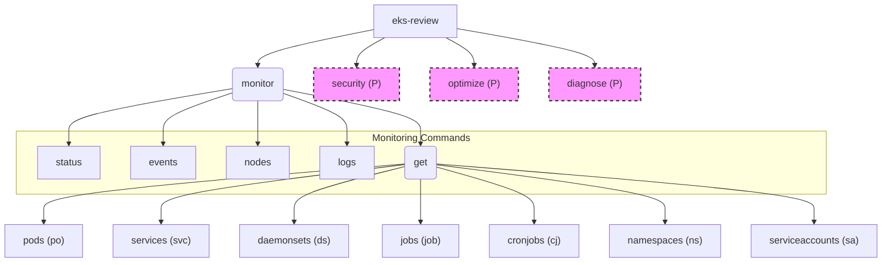

# eks-review

**Kubernetes Cluster Review Tool (EKS)**

---

## 📖 Overview

**eks-review** is a command line tool written in Go that helps inspect and diagnose Kubernetes clusters, with extra focus on Amazon EKS. It automates repetitive tasks, standardizes workflows and gives you a quick look at the state and configuration of your resources.

The CLI provides several subcommands under `monitor` to fetch detailed cluster information, view events and check pod logs, among others.

---

## ✨ Features

- **`monitor status`:** Tabular summary of Pods, Deployments, Services and Ingresses.
- **`monitor events`:** Display recent cluster events with filters for type and namespace.
- **`monitor nodes`:** Detailed information about nodes, including roles, versions and resource usage.
- **`monitor logs`:** Access and filter logs from Pods, Deployments or Services.
- **`monitor get <resource>`:** List different resource types such as:
    - `pods` (`po`)
    - `services` (`svc`)
    - `daemonsets` (`ds`)
    - `jobs` (`job`)
    - `cronjobs` (`cj`)
    - `namespaces` (`ns`)
    - `serviceaccounts` (`sa`)
    - With options to filter by namespace, label selector and output format (table, wide, json, yaml).
- **`security`** *(Planned):* Audit Network Policies, RBAC, container images and Secrets.
- **`optimize`** *(Planned):* Identify unused resources and review autoscaling.
- **`diagnose`** *(Planned):* Diagnose issues in Pods, Services and Ingresses.

---

## 🚀 Installation

Make sure you have Go installed (1.18+ recommended).

### 1. Clone the repository

```bash
git clone https://github.com/Portfolio-jaime/eks-review-cli.git
cd eks-review-cli
```

### 2. Initialize modules and download dependencies

```bash
go mod tidy
```

This command downloads the required libraries (Kubernetes client-go, Cobra, etc.).

> **Note:** Both `go mod tidy` and `go test` need internet access to fetch dependencies. Run them in an environment with connectivity or ensure the Go modules cache is pre-populated.

### 3. Build the CLI

```bash
go build -o eks-review
```

This creates an executable named `eks-review` in the current directory.

💡 **Usage**
Make sure your kubeconfig is configured correctly so it points to your cluster (Minikube, EKS, GKE, etc.). By default `eks-review` reads `~/.kube/config`.

For a complete list of commands, subcommands and flags, see [the Commands Reference](./COMMANDS.en.md).

---

## ⚙️ Advanced Installation (Global `eks-review`)

By default after `go build -o eks-review` you can run the tool with `./eks-review` from the project directory.

If you want to run `eks-review` from anywhere, install the binary in a directory that is in your system `PATH`.

Move the resulting `eks-review` binary to a directory included in your system `PATH` (for example `/usr/local/bin` on Linux or macOS, or a custom directory added to the `PATH` on Windows).

---

## 🗺️ Roadmap and Differential

To see planned features and the differential approach of this project, check [ROADMAP_DIFFERENTIAL.md](./ROADMAP_DIFFERENTIAL.md).

---

## 🏗️ Project Structure

```
eks-review-cli/
├── cmd/
│   ├── diagnose.go
│   ├── events.go
│   ├── get.go
│   ├── get_pods.go
│   ├── get_services.go
│   ├── get_daemonsets.go
│   ├── get_jobs.go
│   ├── get_cronjobs.go
│   ├── get_namespaces.go
│   ├── get_serviceaccounts.go
│   ├── logs.go
│   ├── monitor.go
│   ├── nodes.go
│   ├── optimize.go
│   ├── root.go
│   ├── security.go
│   ├── status.go
│   └── utils.go
├── COMMANDS.en.md
├── go.mod
├── go.sum
├── main.go
├── README.en.md
└── ROADMAP_DIFFERENTIAL.md
```

---

## 📊 Command Diagram



> **Note:** Nodes marked with (P) or dashed lines represent planned functionality.

---

## 🛠️ Included Tools

[](https://kubernetes.io/docs/reference/kubectl/)
[](https://helm.sh/)
[](https://www.docker.com/)

- [kubectl](https://kubernetes.io/docs/reference/kubectl/)
- [Helm](https://helm.sh/)
- [Docker](https://www.docker.com/)

---

## 🤝 Contributing

Contributions are welcome! If you have ideas for new features, improvements or bug fixes, open an issue or send a pull request.
