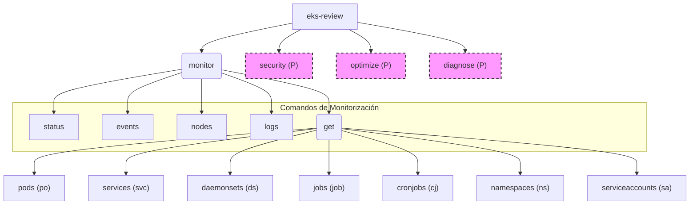

# eks-review-cli

**Herramienta de Revisión de Clústeres de Kubernetes (EKS)**

---

## 📖 Visión General

**eks-review-cli** es una herramienta de línea de comandos (CLI) escrita en Go, diseñada para simplificar la revisión y el diagnóstico de recursos en clústeres de Kubernetes, con un enfoque especial en Amazon EKS. Su objetivo es automatizar tareas repetitivas, estandarizar flujos de trabajo y proporcionar una visión rápida y clara del estado y la configuración de tus recursos de Kubernetes.

La CLI ofrece un conjunto de comandos bajo `monitor` para obtener información detallada de varios recursos del clúster, visualizar eventos, acceder a logs y más.

---

## ✨ Características

- **`monitor status`:** Resumen tabular del estado general de Pods, Deployments, Services e Ingresses.
- **`monitor events`:** Visualización de eventos recientes del clúster, con opciones de filtrado por tipo y namespace.
- **`monitor nodes`:** Información detallada de los nodos, incluyendo estado, roles, versiones y uso de recursos.
- **`monitor logs`:** Acceso y filtrado de logs de Pods, Deployments o Services.
- **`monitor get <recurso>`:** Permite listar de forma detallada diversos tipos de recursos como:
    - `pods` (alias `po`)
    - `services` (alias `svc`)
    - `daemonsets` (alias `ds`)
    - `jobs` (alias `job`)
    - `cronjobs` (alias `cj`)
    - `namespaces` (alias `ns`)
    - `serviceaccounts` (alias `sa`)
    - Con opciones de filtrado por namespace, selector de etiquetas y formatos de salida (tabla, wide, json, yaml).
- **`security`** *(Planificado):* Auditoría de Network Policies, RBAC, imágenes de contenedores y Secrets.
- **`optimize`** *(Planificado):* Identificación de recursos no utilizados y revisión de autoescalado.
- **`diagnose`** *(Planificado):* Diagnóstico de problemas en Pods, Services e Ingresses.

---

## 🚀 Instalación

Asegúrate de tener Go instalado (versión 1.18+ recomendada).

### 1. Clonar el repositorio

```bash
git clone https://github.com/Portfolio-jaime/eks-review-cli.git
cd eks-review-cli
```

### 2. Inicializar módulos Go y descargar dependencias

```bash
go mod tidy
```

Este comando descargará todas las librerías necesarias (Kubernetes client-go, Cobra, etc.).

### 3. Compilar la CLI

```bash
go build -o eks-review
```

Esto creará un ejecutable llamado `eks-review` en el directorio actual.

💡 **Uso**  
Asegúrate de que tu kubeconfig esté configurado correctamente para apuntar a tu clúster de Kubernetes (Minikube, EKS, GKE, etc.).  
Por defecto, `eks-review` leerá tu kubeconfig en `~/.kube/config`.

Para una lista completa y detallada de todos los comandos, sus subcomandos y todas sus opciones, por favor consulta la Referencia de Comandos en [COMMANDS.md](./COMMANDS.md).

---

## ⚙️ Instalación Avanzada (Acceso Global como `kcli`)

Por defecto, después de compilar con `go build -o kcli`, puedes ejecutar la herramienta desde el directorio del proyecto con `./kcli`.

Si deseas poder ejecutar `kcli` desde cualquier ubicación en tu terminal, necesitarás instalar el binario en un directorio que esté en tu `PATH` del sistema.

Para instrucciones detalladas sobre cómo compilar con el nombre `kcli` e instalarlo globalmente en diferentes sistemas operativos, consulta nuestra [Guía de Instalación Avanzada](INSTALLATION_ADVANCED.md).

---

## 🗺️ Roadmap y Diferencial

**Para ver el roadmap de funcionalidades y el enfoque diferencial de este proyecto, consulta [ROADMAP_DIFERENCIAL.md](./ROADMAP_DIFERENCIAL.md).**

---

## 🏗️ Estructura del Proyecto

```
eks-review-cli/
├── cmd/
│   ├── diagnose.go
│   ├── events.go
│   ├── get.go
│   ├── get_pods.go
│   ├── get_services.go
│   ├── get_daemonsets.go
│   ├── get_jobs.go
│   ├── get_cronjobs.go
│   ├── get_namespaces.go
│   ├── get_serviceaccounts.go
│   ├── logs.go
│   ├── monitor.go
│   ├── nodes.go
│   ├── optimize.go
│   ├── root.go
│   ├── security.go
│   ├── status.go
│   └── utils.go
├── COMMANDS.md
├── go.mod
├── go.sum
├── main.go
├── README.md
├── ROADMAP_DIFERENCIAL.md
├── INSTALLATION_ADVANCED.md
└── (otros archivos de configuración o scripts)
```

---

## 📊 Diagrama de Comandos



> **Nota:** Los nodos marcados con (P) o con línea discontinua representan funcionalidades planificadas.

---

## 🛠️ Herramientas Incluidas

[](https://kubernetes.io/docs/reference/kubectl/)
[](https://helm.sh/)
[](https://www.docker.com/)

- [kubectl](https://kubernetes.io/docs/reference/kubectl/)
- [Helm](https://helm.sh/)
- [Docker](https://www.docker.com/)

---

## 🤝 Contribuciones

¡Las contribuciones son bienvenidas!  
Si tienes ideas para nuevas características, mejoras o correcciones de errores, no dudes en abrir un issue o enviar un pull request.