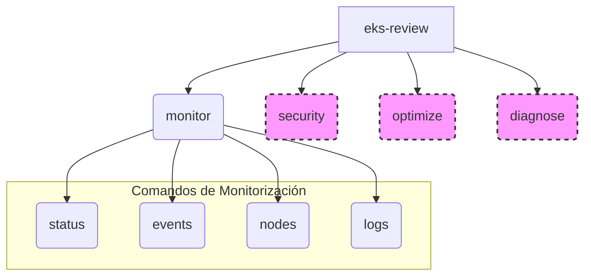

# eks-review-cli

**Herramienta de Revisión de Clústeres de Kubernetes (EKS)**

---

## 📖 Visión General

**eks-review-cli** es una herramienta de línea de comandos (CLI) escrita en Go, diseñada para simplificar la revisión y el diagnóstico de recursos en clústeres de Kubernetes, con un enfoque especial en Amazon EKS. Su objetivo es automatizar tareas repetitivas, estandarizar flujos de trabajo y proporcionar una visión rápida y clara del estado y la configuración de tus recursos de Kubernetes.

Actualmente, la CLI se enfoca en el subcomando `monitor`, permitiendo a los usuarios obtener un resumen del estado de los recursos clave (`status`), visualizar los eventos del clúster (`events`), obtener detalles de los nodos (`nodes`) y acceder a los logs de los pods (`logs`).

---

## ✨ Características

- **monitor status:** Resumen tabular del estado de Pods, Deployments, Services e Ingresses.
- **monitor events:** Visualización de eventos recientes del clúster, con opciones de filtrado por tipo y namespace.
- **monitor nodes:** Información detallada de los nodos, incluyendo estado, roles, versiones y uso de recursos (si el servidor de métricas está disponible).
- **monitor logs:** Acceso y filtrado de logs de Pods, Deployments o Services.
- **security** *(Planificado):* Auditoría de Network Policies, RBAC, imágenes de contenedores y Secrets.
- **optimize** *(Planificado):* Identificación de recursos no utilizados y revisión de autoescalado.
- **diagnose** *(Planificado):* Diagnóstico de problemas en Pods, Services e Ingresses.

---

## 🚀 Instalación

Asegúrate de tener Go instalado (versión 1.18+ recomendada).

### 1. Clonar el repositorio

```bash
git clone https://github.com/Portfolio-jaime/eks-review-cli.git
cd eks-review-cli
```

### 2. Inicializar módulos Go y descargar dependencias

```bash
go mod tidy
```
Este comando descargará todas las librerías necesarias (Kubernetes client-go, Cobra, etc.).

### 3. Compilar la CLI

```bash
go build -o eks-review
```
Esto creará un ejecutable llamado `eks-review` en el directorio actual.

---

## 💡 Uso

Asegúrate de que tu kubeconfig esté configurado correctamente para apuntar a tu clúster de Kubernetes (Minikube, EKS, GKE, etc.).  
Por defecto, eks-review-cli leerá tu kubeconfig en `~/.kube/config`.

Para una lista completa y detallada de todos los comandos, sus subcomandos y todas sus opciones, consulta la [Referencia de Comandos](./COMMANDS.md).

### Ejemplos Rápidos

Ver el estado de los recursos en el namespace actual/por defecto:
```bash
./eks-review monitor status
```

Ver los eventos de tipo 'Warning' en el namespace `my-app`:
```bash
./eks-review monitor events -n my-app --type Warning
```

Ver información detallada de los nodos:
```bash
./eks-review monitor nodes
```

Seguir los logs de un deployment:
```bash
./eks-review monitor logs --deployment my-deployment -f
```

Para obtener ayuda sobre un comando específico y sus flags:
```bash
./eks-review [comando] [subcomando] --help
```

---

## 🏗️ Estructura del Proyecto

```
eks-review-cli/
├── cmd/
│   ├── diagnose.go     # Comandos de diagnóstico
│   ├── events.go       # Implementación de 'monitor events'
│   ├── logs.go         # Implementación de 'monitor logs'
│   ├── monitor.go      # Comando base 'monitor'
│   ├── nodes.go        # Implementación de 'monitor nodes'
│   ├── optimize.go     # Comandos de optimización
│   ├── root.go         # Comando raíz de la CLI
│   ├── security.go     # Comandos de seguridad
│   ├── status.go       # Implementación de 'monitor status'
│   └── utils.go        # Funciones de utilidad
├── COMMANDS.md         # Referencia Detallada de Comandos
├── go.mod              # Definición del módulo Go y dependencias
├── go.sum              # Sumas de verificación de dependencias
├── main.go             # Punto de entrada de la aplicación
├── README.md           # Este archivo
└── (otros archivos de configuración o scripts)
```

---

## 📊 Diagrama de Comandos


> Los nodos marcados con línea discontinua representan funcionalidades planificadas.

---

## 🤝 Contribuciones

¡Las contribuciones son bienvenidas!  
Si tienes ideas para nuevas características, mejoras o correcciones de errores, no dudes en abrir un issue o enviar un pull request.

---